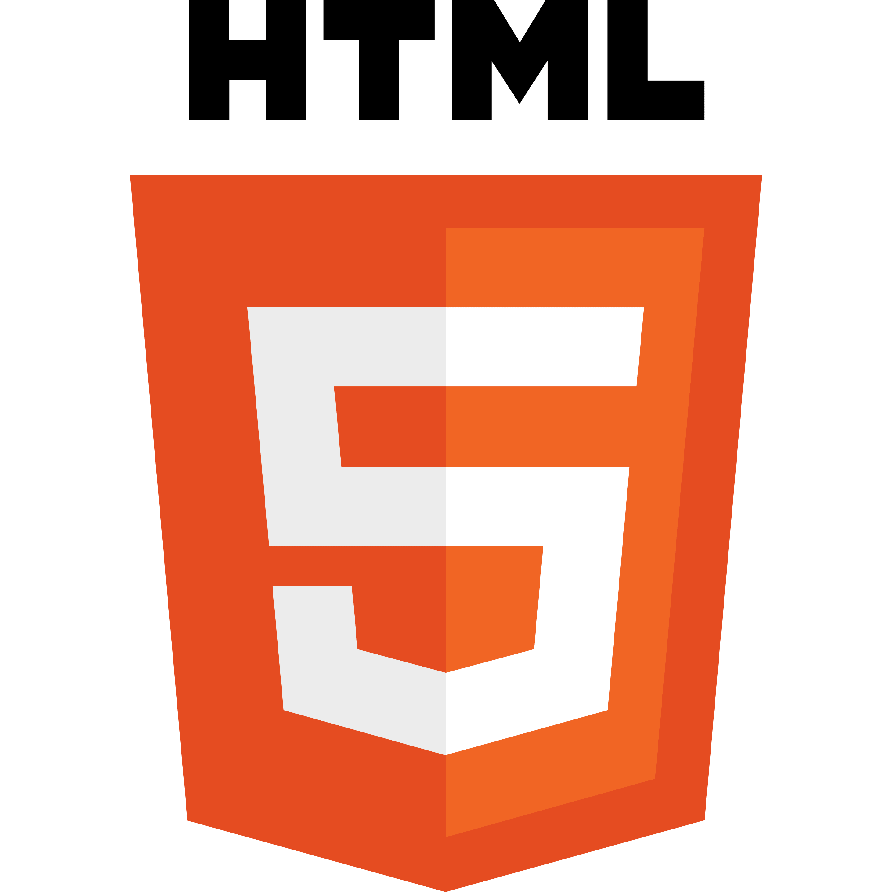
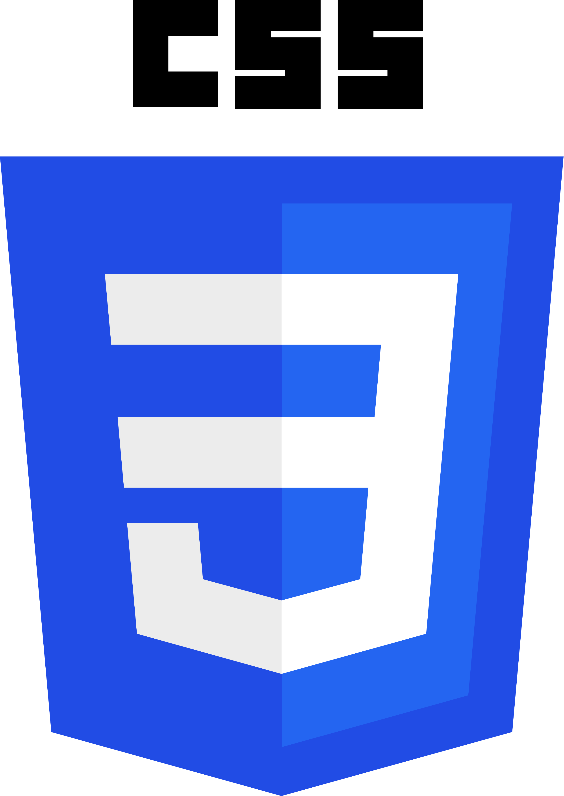

# Well, hello there

### About me

- Front-end Develepoment Degree
- I've also studied electrical engineering at *University of South-East Norway* where I've learned some back-end as well. Didn't finish the degree because I switched to front-end.
- I like to experiment with styles to see what works and doesn't, with all the fun stuff that follows.

### Skills

|                                                                                 | Main languages |
| ------------------------------------------------------------------------------: | -------------- |
|        | HTML 5         |
|  | CSS            |
|                    | Javascript     |

Other languages:

- Typescript
- Swift
- C#
- Python
- SQL
- PLC
- And now Markdown appearantly

I've also got experience with **Wordpress** and trying to learn new frameworks as well. 

I'm using my  to practice what I've learned as well, with this .

### Other than that

I'm also a musician and a general tech-head that likes to tinker with smart-products within among other things, HomeKit.

